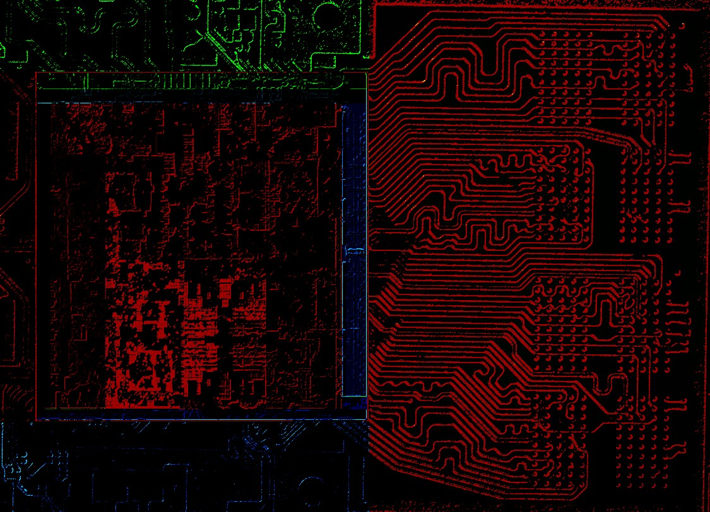

# Furmark-NX

Heavily based off [Furmark by StanislavPetrovV](https://github.com/StanislavPetrovV/FurMark/tree/main})

- A Stress Testing Utility for the Nintendo Switch.
- This tool currently has 6 stress tests avaliable, with work on a proper UI and Deko3D ports started.
- Given its purpose, if used on high enough clockspeeds and timespans, this will cause hardware damage.
- While Furmark can be used to find instability, it is generally not good at it and thus will only crash once much larger issues are present.

## Furmark

- Uses an OpenGL shader to draw as much power as possible
- Renders at 1280x720, using a path tracing setup
- The path tracer allows rays to take 48 steps before quitting.

## Furmark-RAM Stress

- Uses the same core shader as Furmark, however this copies 4 textures every frame to stress memory.
- This also reduces the ray stepping to 32 steps, and changes the perspective of the render.

## GPU Path Tracing

- This uses a standard cornel box scene at 1280x720.
- Rays can take 80 steps, although this is more of a hard limit as rasing it simply produced lower results.
- Reducing the step count meanwhile only introduced visual glitches.
- Rays bounce 3 times before stopping.
- The image is then constantly sampled to denoise.

## CPU + GPU Black Hole

- This uses both the CPU and GPU to render a black hole with an accretion disk and skybox.
- The GPU renders the inner region of the frame, with a 320 step ray tracer for gravitaional lensing around the black hole and accretion disk
- This is rendered at 1280x720, with a procedural star field in the background, and bloom opperating at 160x90.
- A final checkerboard pass is then used to discard repeat pixels.
- CPU uses 2 threads to trace 80 steps through the outer region at 480x270.
- Both pipelines act independently, with two seperate frame rate meters.

## CPU Ray Tracing

- Uses the same scene as GPUPT, however it now runs on the CPU.
- The same parameters are used, with necesarry changes made to run on CPU.
- This test heavily uses NEON piplines while using the GPU to display the final image.
- This runs on all avaliable threads (3) on stock atmosphere.
- Denoising is similar to GPUPT.

## CPU RAM Stress

- This is a modified version of CPURT, now stressing memory.
- Rendering resolution is reduced to 640x360.
- This test uses 4 FBOs and constantly copies between them, stressing memory.
- Results are about 50-28% as good as GPURT depending on clockspeeds.
